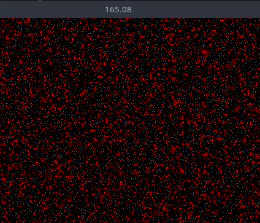

# Bevy Game of Life Shader Example Part 3

It is exciting to finally see some progress after so much boilerplate! Let's change up the color scheme a bit! I like the color red, so let's make the
alive cells red. In our shader, switch the init_pipeline color to the following:

```glsl
@compute @workgroup_size(8, 8, 1)
fn init(@builtin(global_invocation_id) invocation_id: vec3<u32>, @builtin(num_workgroups) num_workgroups: vec3<u32>) {
    let location = vec2<i32>(invocation_id.xy);

    let randomNumber = randomFloat(invocation_id.y * num_workgroups.x + invocation_id.x);
    let alive = randomNumber > 0.9;
    let color = vec4<f32>(f32(alive), 0.0, 0.0, 1.0); // NEW

    textureStore(texture, location, color);
}
```

And you should see something like this:



Very red! Now onto our update pipeline, which makes all this worth it to see the cells move.

## Update Pipeline

Back in `pipeline.rs` lets update our match statement within the run function of our node.

```rust
// select the pipeline based on the current state
match self.state {
    GameOfLifeState::Loading => {}
    GameOfLifeState::Init => {
        let init_pipeline = pipeline_cache
            .get_compute_pipeline(pipeline.init_pipeline)
            .unwrap();
        pass.set_pipeline(init_pipeline);
        pass.dispatch_workgroups(
            SIM_SIZE.0 / WORKGROUP_SIZE,
            SIM_SIZE.1 / WORKGROUP_SIZE,
            1,
        );
    }
    GameOfLifeState::Update => {
        let update_pipeline = pipeline_cache
            .get_compute_pipeline(pipeline.update_pipeline)
            .unwrap();
        pass.set_pipeline(update_pipeline);
        pass.dispatch_workgroups(
            SIM_SIZE.0 / WORKGROUP_SIZE,
            SIM_SIZE.1 / WORKGROUP_SIZE,
            1,
        );
    }
}
```

It is exactly the same as the init pipeline, we just use the update pipeline instead. That takes care of the rust side of things, now onto the shader.

## Conway's Game of Life

The particular bit of cellular automata we are implementing is `Conway's Game of Life`. The rules are as follows:

1. Any live cell with fewer than two live neighbours dies, as if by underpopulation.
2. Any live cell with two or three live neighbours lives on to the next generation.
3. Any live cell with more than three live neighbours dies, as if by overpopulation.
4. Any dead cell with exactly three live neighbours becomes a live cell, as if by reproduction.

These rules, which compare the behaviour of the automaton to real life, can be condensed into the following:

1. Any live cell with two or three live neighbours survives.
2. Any dead cell with three live neighbours becomes a live cell.
3. All other live cells die in the next generation. Similarly, all other dead cells stay dead.

Back in our update fn, lets start by pulling the current location

```glsl
@compute @workgroup_size(8, 8, 1)
fn update(@builtin(global_invocation_id) invocation_id: vec3<u32>) {
    let location = vec2<i32>(invocation_id.xy);
}
```

Now we need to count the number of alive neighbors, but to do that, we need a way to tell if a cell is alive or dead.
Add the following utility function

```glsl
...
fn is_alive(location: vec2<i32>, offset_x: i32, offset_y: i32) -> u32 {
    let value: vec4<f32> = textureLoad(texture, location + vec2<i32>(offset_x, offset_y));
    return u32(value.x);
}
...
```

This function takes in a location, and an offset. We store all our data within the texture itself as colors. (in our instance its red colors for alive \
and black for dead). `textureLoad` loads the color at the given location. We know a cell is alive if the color returned is red, which is a value of 1.0 a `x`

Now that we have a way to tell if a cell is alive, we can move onto counting the neighbors. We need to check the 8 cells surrounding the current cell.
We can acheive this using a simple nested for loop. Here is what I came up with:

```glsl
fn count_neighbors_simple(location: vec2<i32>) -> u32 {
    var result: u32 = 0u;
    for (var x: i32 = -1; x < 2; x++) {
        for (var y: i32 = -1; y < 2; y++) {
            if x == 0 && y == 0 {
                continue;
            }

            result += is_alive(location, x, y); 
        }
    }
    return result;
}
```

We take in a location to count the neighbors of, and return the number of alive neighbors by looping through the 8 surrounding cells
and calling our `is_alive` function. Lets add this to our update function:

```glsl
@compute @workgroup_size(8, 8, 1)
fn update(@builtin(global_invocation_id) invocation_id: vec3<u32>) {
    let location = vec2<i32>(invocation_id.xy);
    let is_alive = bool(is_alive(location, 0, 0));
    let num_neighbors = count_neighbors_simple(location);
}
```

It is pretty staight forward from here, we just need to implement the rules from above.

```glsl
...

var result: u32 = 0u;

if (is_alive) { 
    result = ((u32((num_neighbors) == (2u))) | (u32((num_neighbors) == (3u)))); 
} else { 
    result = u32((num_neighbors) == (3u)); 
}

let color = vec4<f32>(f32(result), 0.0, 0.0, 1.0);
textureStore(texture, location, color);
```

If the current cell is alive, we check if it has 2 or 3 neighbors, if it does, it lives on, otherwise it dies. If the current cell is dead,
we check if it has 3 neighbors, if it does, it becomes alive, otherwise it stays dead. Then we store our result as a color in the texture (red in this case).

> Note: I removed the window_fps plugin and `FrameTimeDiagnosticsPlugin` plugin. It was slowing down my app when running.
> I also disabled `bevy::window::PresentMode::AutoNoVsync` otherwise, the app runs at like 3k fps XD

Running the app should now show the cells moving around!!! How cool!


Code can be found on github: [Part 3](https://github.com/lecoqjacob/bevy_shader_playground/blob/fb19ddc592691e4e89582a0954f7963eea9300de/sims/game_of_life_sim/src/lib.rs)
