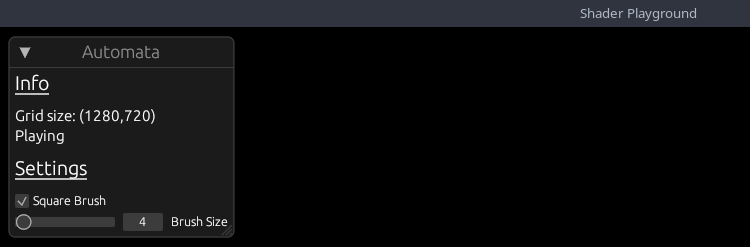

# Bevy Game of Life Shader Example Part 5

## Square Challenge

<details>
<summary>Spoiler warning</summary>

In the past tutorial, I challenged you to draw a square instead of a circle. Let's see how your implementation compares to mine.

```glsl
fn draw_particle_square(pos: vec2<f32>, draw_pos: vec2<f32>, size: f32)  {
    let y_start = draw_pos.y - size / 2.;
    let y_end = draw_pos.y + size / 2.;
    let x_start = draw_pos.x - size / 2.;
    let x_end = draw_pos.x + size / 2.;
    if (pos.x >= x_start && pos.x <= x_end && pos.y >= y_start && pos.y <= y_end) {
        textureStore(texture, vec2<i32>(pos), vec4<f32>(1.0, 1.0, 1.0, 1.0));
    }
}
```

</details>

## Quick Renames

If you previous completed part_4, I changed `InputState` => `AutomataParams`.

## UI

Before we continue with the graphical side of things, let's add some UI to our game. I prefer to use [egui] in my projects, and there is a wonderful
integration crate for bevy [bevy_egui]. Let's add it to our project.

> $ `cargo add bevy_egui`

Our UI will be pretty simplicstic for now. We will show the base simulation properties, and a couple of overridable properties. We are going to quickly
add some new properties that we will use.

```rust
pub struct AutomataParams {
    pub is_paused: bool, // NEW
    pub is_drawing: bool,
    pub can_scroll: bool, // NEW
    pub use_square_brush: bool, // NEW

    pub radius: f32, // NEW
    pub mouse_pos: Vec2,
    pub prev_mouse_pos: Vec2,
}

impl Default for AutomataParams {
    fn default() -> Self {
        Self {
            is_paused: false, // NEW
            can_scroll: true, // NEW
            is_drawing: false,
            use_square_brush: true, // NEW

            radius: 4.0, // NEW
            mouse_pos: Vec2::ZERO,
            prev_mouse_pos: Vec2::ZERO,
        }
    }
}
```

Now lets build our UI!

```rust
const SPACING: f32 = 10.0;
const TEXT_SIZE: f32 = 15.0;
const HEADING_SIZE: f32 = 20.0;

#[bevy_plugin]
pub fn UIPlugin(app: &mut App) {
    app.add_plugin(EguiPlugin).add_system(user_interface); // Remember to add the EguiPlugin
}

/// Give our text a custom size
fn sized_text(ui: &mut Ui, text: impl Into<String>) {
    ui.label(
        egui::RichText::new(text)
            .size(TEXT_SIZE)
            .color(egui::Color32::WHITE),
    );
}

fn heading(ui: &mut Ui, text: impl Into<String>) {
    ui.heading(
        egui::RichText::new(text)
            .underline()
            .size(HEADING_SIZE)
            .color(egui::Color32::WHITE),
    );
}
```

I am adding a couple of helper methods just to make things easier and reduce the boilerplate I have to write later :D

```rust
/// System to generate user interface with egui
pub fn user_interface(mut contexts: EguiContexts, mut params: ResMut<AutomataParams>) {
    egui::Window::new("Automata")
        .constrain(true)
        .fixed_pos(egui::pos2(10.0, 10.0))
        .show(contexts.ctx_mut(), |ui| {
            ui.visuals_mut().override_text_color = Some(egui::Color32::WHITE);

            heading(ui, "Info");
            ui.add_space(SPACING);

            sized_text(ui, format!("Grid size: ({},{})", SIM_SIZE.0, SIM_SIZE.1));

            sized_text(
                ui,
                (if params.is_paused {
                    "Paused"
                } else {
                    "Simulating"
                })
                .to_string(),
            );

            ui.add_space(SPACING);
            heading(ui, "Settings");
            ui.add_space(SPACING);

            ui.checkbox(&mut params.use_square_brush, "Square Brush");
            ui.add(egui::Slider::new(&mut params.radius, 1.0..=200.0).text("Brush Size"));
        });
}
```

Our `Info` section will show the size of our grid, and if our simulation is currently running. The `Settings` section will
allow us to change the brush size and toggle between a square brush or circular brush.

Add the plugin to our main plugin, and run the application. This is how it looks:



Let's hookup these properties to our application so we can actually use them!!

In our `update_input_state` system, we need to check if Egui is currently being hovered, or capturing the mouse. If so, we need to disable certain inputs
from happening while the UI is `active`.

```rust
pub fn update_input_state(
    mut contexts: EguiContexts, // NEW
    window_query: Query<&Window>,
    mut params: ResMut<AutomataParams>,
    keyboard_input: Res<Input<KeyCode>>, // NEW
    camera_q: Query<(&Camera, &GlobalTransform)>,
    mut mouse_button_input_events: EventReader<MouseButtonInput>,
) {
    let Ok(primary_window) = window_query.get_single() else { return };
    // get the camera info and transform
    let Ok((camera, camera_transform)) = camera_q.get_single() else { return };

    let ctx = contexts.ctx_mut();
    if ctx.wants_pointer_input()
        || ctx.is_pointer_over_area()
        || ctx.is_using_pointer()
        || ctx.wants_pointer_input()
    {
        // GUI gets priority input
        params.is_drawing = false;
        params.can_scroll = false;
        return;
    } else {
        params.can_scroll = true;
    }
...
```

Essentiall, if the UI is currently using the mouse, we don't want to allow the user to draw on the grid, or scroll the camera.

Now we can hookup our `is_paused` property to our simulation. We will do this in the `update_simulation` system.

```rust
...
// Pause the simulation
if keyboard_input.just_pressed(KeyCode::Space) {
    params.is_paused = !params.is_paused;
}
...
```

Feel free to use whatever KeyCode you wish, but we just flip the simulation run state when the user presses the spacebar.

Quickly flipping to our `camera_controller` system, we can disable scroll events based on our new property.

```rust
pub fn camera_controller(
    time: Res<Time>,
    params: Res<AutomataParams>, // NEW
    keyboard_input: Res<Input<KeyCode>>,
    mut mouse_wheel_events: EventReader<MouseWheel>,
    mut query: Query<(&mut Transform, &mut OrthographicProjection), With<Camera>>,
)
...
// =========== Zoom =========== //
if params.can_scroll { // NEW
    // zoom code
}
```

In our automata pipeline, we can disable the pipeline if the simulation is paused.

```rust
fn run(
    &self,
    _graph: &mut render_graph::RenderGraphContext,
    render_context: &mut RenderContext,
    world: &World,
) -> Result<(), render_graph::NodeRunError> {
    let is_paused = &world.resource::<AutomataParams>().is_paused;

    if !is_paused {
        // run the init / update pipelines
    }

    Ok(())
}
```

And finally, we can use the two new params in our `AutomataPushConstants` for our `draw_pipeline`.

```rust
pub struct AutomataPushConstants {
    draw_start: [f32; 2],
    draw_end: [f32; 2],
    draw_radius: f32,
    draw_square: u32, // NEW
}

impl AutomataPushConstants {
    pub fn new(draw_start: Vec2, draw_end: Vec2, draw_radius: f32, draw_square: bool) -> Self {
        Self {
            draw_radius,
            draw_end: draw_end.to_array(),
            draw_square: draw_square as u32,  // NEW
            draw_start: draw_start.to_array(),
        }
    }
}

...

let pc = AutomataPushConstants::new(
    params.mouse_pos,
    params.prev_mouse_pos,
    params.radius, // NEW
    params.use_square_brush, // NEW
);
...
```

Currently, there is no bool type for `push_constants` so a `u32` will have to do.

To finish up our integrations, we need to fix our `draw.wgsl` to use the new `draw_square` property.

```glsl
struct PushConstants {
    draw_start: vec2<f32>,
    draw_end: vec2<f32>,
    draw_radius: f32,
    draw_square: u32,
}
var<push_constant> pc: PushConstants;

...

fn draw_particle_square(pos: vec2<f32>, draw_pos: vec2<f32>, size: f32)  {
    let y_start = draw_pos.y - size / 2.;
    let y_end = draw_pos.y + size / 2.;
    let x_start = draw_pos.x - size / 2.;
    let x_end = draw_pos.x + size / 2.;
    if (pos.x >= x_start && pos.x <= x_end && pos.y >= y_start && pos.y <= y_end) {
        textureStore(texture, vec2<i32>(pos), vec4<f32>(1.0, 1.0, 1.0, 1.0));
    }
}

...

if (pc.draw_radius > 0.0) {
    let pos = vec2<f32>(pixel);
    let point_on_line = closest_point_on_line(pc.draw_start, pc.draw_end, pos);

    // NEW BLOCK
    if (bool(pc.draw_square)){
        draw_particle_square(pos, point_on_line, pc.draw_radius);
    }else{
        draw_particle_circle(pos, point_on_line, pc.draw_radius);
    }
}
```

Running our simulation now: We can see the UI is working as expected! We can change the radius, and even pause the simulation with `Space`.


Whew that was alot, but we have a working UI now! I now want to explore another feature of wgpu, `buffers`. Currently, we have been storing
all of our cell data as colors in our texture, but what if we wanted to store more data? We could use different values within the color channels,
but that would get messy quickly and would also be hard to track, instead we are going to store our cells in `buffers` and use the buffers to
paint to the texture.

## Buffers

> A buffer is a blob of data on the GPU. A buffer is guaranteed to be contiguous, meaning that all the data is stored
> sequentially in memory. Buffers are generally used to store simple things like structs or arrays, but they can store
> more complex stuff such as graph structures like trees (provided all the nodes are stored together and don't reference anything outside of the buffer)

To get started, we are going to add a `Uniform` buffer for our simulation size, instead of querying the texture each time. This is a pretty simplicstic
example for a uniform buffer, but it will help us understand the basics.

### Uniform Buffers

> A uniform is a blob of data that is available to every invocation of a set of shaders.
> We've technically already used uniforms for our texture and sampler.
> Uniform buffers are great for small, read only data

Add a helper method to our `utils.rs` file:

```rust
pub fn create_uniform_buffer<T: bytemuck::Pod + bytemuck::Zeroable>(
    device: &RenderDevice,
    data: &[T],
    label: Option<&str>,
) -> Buffer {
    device.create_buffer_with_data(&BufferInitDescriptor {
        label,
        contents: bytemuck::cast_slice(data),
        usage: BufferUsages::UNIFORM | BufferUsages::COPY_DST,
    })
}
```

We using our handy dandy `RenderDevice` to create a buffer with initial data. The contents has to be `&[u8]` so we use bytemuck to cast our data to bytes.
Notice the buffer usage. `UNIFORM` because this will be a uniform buffer and `COPY_DST` allows a buffer to be the destination buffer for
a `CommandEncoder::copy_buffer_to_buffer`, `CommandEncoder::copy_texture_to_buffer`, `CommandEncoder::clear_buffer` or `Queue::write_buffer` operation.

Over in our `setup` system where we create our image, lets also add our buffers.

```rust
// NEW
#[derive(Resource, Clone, ExtractResource)]
pub struct GameOfLifeBuffers {
    pub uniform_buffer: Buffer,
}

fn setup(mut commands: Commands, mut images: ResMut<Assets<Image>>, device: Res<RenderDevice>) {
    ...
    let uniform_size_buffer = utils::create_uniform_buffer(
        &device,
        &[SIM_SIZE.0, SIM_SIZE.1],
        Some("Simulation Size Uniform"),
    );

    commands.spawn(Camera2dBundle::default());
    commands.insert_resource(GameOfLifeImage(image));

    // NEW
    commands.insert_resource(GameOfLifeBuffers {
        uniform_buffer: uniform_size_buffer, 
    });
}
```

Using our helper method, we create a buffer with two `u32` values: `sim_width` and `sim_height` and insert it into our resources.
As previously where we had to tell our pipeline about the entire layout, we need to add the uniform buffer description as well.

Remember to add the `ExtractResourcePlugin` to the main plugin:

```rust
.add_plugin(ExtractResourcePlugin::<GameOfLifeBuffers>::default())
```

Starting with `AutomataPipeline` in the `FromWorld` implementation:

```rust
.create_bind_group_layout(&BindGroupLayoutDescriptor {
    label: Some("Game of Life Bind Group Layout"),
    entries: &[
        BindGroupLayoutEntry {
            binding: 0,
            count: None,
            visibility: ShaderStages::COMPUTE,
            ty: BindingType::Buffer {
                ty: BufferBindingType::Uniform,
                has_dynamic_offset: false,
                min_binding_size: BufferSize::new(
                    (2 * std::mem::size_of::<u32>()) as _,
                ),
            },
        },
        BindGroupLayoutEntry {
            binding: 1,
            visibility: ShaderStages::COMPUTE,
            ty: BindingType::StorageTexture {
                access: StorageTextureAccess::ReadWrite,
                format: TextureFormat::Rgba8Unorm,
                view_dimension: TextureViewDimension::D2,
            },
            count: None,
        },
    ],
});
```

We are setting our uniform buffer as the first binding, this is important because changing our layout will have to also be reflected in the `BindGroup` and
related shader. The entry type is `BufferBindingType::Uniform` and we set the `min_binding_size` to the size of `2` `u32` values.

Then in our `bind_group` creation:

```rust
let bind_group = render_device.create_bind_group(&BindGroupDescriptor {
    label: Some("Game of Life Bind Group"),
    layout: &pipeline.texture_bind_group_layout,
    entries: &[
        BindGroupEntry {
            binding: 0,
            resource: buffers.uniform_buffer.as_entire_binding(),
        },
        BindGroupEntry {
            binding: 1,
            resource: BindingResource::TextureView(&view.texture_view),
        },
    ],
});
```

Finally we can modify our shader to intake this new layout:

```glsl
// game_of_life.wgsl

@group(0) @binding(0) 
var<uniform> size : vec2<u32>; // width, height
@group(0) @binding(1)
var texture: texture_storage_2d<rgba8unorm, read_write>;

...

fn is_alive(location: vec2<i32>, offset_x: i32, offset_y: i32) -> u32 {
    var loc = ((location + vec2<i32>(offset_x, offset_y)) + vec2<i32>(size)) % vec2<i32>(size);
    let value: vec4<f32> = textureLoad(texture, loc);
    return u32(value.x);
}
```

Our uniform is a `vec2<u32>`, for width/height, and we can now replaced our previous calls with `textureDimensions` with `size`.

> Challenge: Can you add the uniform buffer to the draw pipeline and use it within the shader?
<details>
<summary>Challenge Spoiler</summary>

Adding the uniform to the draw pipeline is exactly the same as the compute pipeline. This is the resulting shader code from the buffer:

```glsl
@compute @workgroup_size(8, 8, 1)
fn draw(@builtin(global_invocation_id) invocation_id: vec3<u32>)
{
    let pixel = vec2<u32>(invocation_id.xy);
    if (pixel.x >= size.x && pixel.y >= size.y) { // NEW
        return ;
    }

    if (pc.draw_radius > 0.0) {
        let pos = vec2<f32>(pixel);
        let point_on_line = closest_point_on_line(pc.draw_start, pc.draw_end, pos);

        if (bool(pc.draw_square)){
            draw_particle_square(pos, point_on_line, pc.draw_radius);
        }else{
            draw_particle_circle(pos, point_on_line, pc.draw_radius);
        }
    }
}
```

Review the [source](https://github.com/lecoqjacob/bevy_shader_playground/blob/main/sims/game_of_life_sim/src/pipeline/draw.rs) for the full implementation.

</details>

### Storage Buffers

> Storage buffers are usually slightly slower than uniform buffers, but they can be much, much bigger. They can be read or written to.
> They are useful for storing large amounts of data that is read or written to by shaders.

We are going to use `StorageBuffers` to store our cell data. Now before we start creating and hooking up our storage buffer, I want to explain the reasoning
for switching to a storage buffer. Previously we were using a `Texture2d` to store our cell data. This was great for single value fields, but I want
to store more data per cell, specifically, I want to allow for the simulation to have a heat map based on cell state.\

```rust
sturct Cell{
    alive: u32,
    heat: f32,
}
```

This will be the struct inside our shader, so lets keep that in mind when creating the buffers. Let's add another helper method to our `utils` module:

```rust
pub fn create_storage_buffer_with_data<T: bytemuck::Pod + bytemuck::Zeroable>(
    device: &RenderDevice,
    data: &[T],
    label: Option<&str>,
) -> Buffer {
    device.create_buffer_with_data(&BufferInitDescriptor {
        label,
        contents: bytemuck::cast_slice(data),
        usage: BufferUsages::STORAGE | BufferUsages::COPY_DST,
    })
}
```

Same as our uniform buffer, but this time we are using `BufferUsages::STORAGE`.

Then in our setup:

```rust
#[derive(Resource, Clone, ExtractResource)]
pub struct GameOfLifeBuffers {
    pub uniform_buffer: Buffer,
    pub in_out_buffers: Vec<Buffer>, // NEW
}

...

// We multiply by 2 because we need to store `alive` and `heat` data for each cell.
let initial_life_data = vec![0u32; 2 * NUM_OF_CELLS];
let buffers = (0..2)
    .map(|i| {
        utils::create_storage_buffer_with_data(
            &device,
            &initial_life_data,
            Some(&format!("Game of Life Buffer {i}")),
        )
    })
    .collect::<Vec<_>>();

commands.spawn(Camera2dBundle::default());
commands.insert_resource(GameOfLifeImage(image));
commands.insert_resource(GameOfLifeBuffers {
    in_out_buffers: buffers, // NEW!!
    uniform_buffer: uniform_size_buffer,
});
```

First thing you probably notice is that we are adding two buffers. The reason for this is we are going to use the `ping-pong` technique to swap between
buffers. This is a common technique used in graphics programming. We will be using one buffer to read from and one buffer to write to. Then we will
swap the buffers and repeat.

You can determine the state of each cell by its neighbors, then write the new state to an output buffer, and repeat each frame
swapping the output buffer to be the new input. Each pixel calculation can be done independently of each other despite the neighbor relations.
Or a fractal. These are what you'd call [embarrassingly parallel](https://en.wikipedia.org/wiki/Embarrassingly_parallel). We want that.

> 1. Read Buffer Input
> 2. Determine new state
> 3. Write Buffer Output
> 4. Swap Buffer Input and Buffer Output
> Repeat

To flip the input buffer with the ouput buffer, we are going to keep track of a simple frame counter and just modulo it by 2.

```rust
pub struct AutomataParams {
    pub is_paused: bool,
    pub is_drawing: bool,
    pub can_scroll: bool,
    pub use_square_brush: bool,

    pub radius: f32,
    pub mouse_pos: Vec2,
    pub prev_mouse_pos: Vec2,
    pub frame: Arc<Mutex<usize>>, /// NEW
}
```

Now why an `Arc<Mutex>`? Because our AutomataParams exist within the main world, and are copied into the render world each frame, we have no way to get
changes back to the main world, if we manipulated the `frame` directly. So we are going to use an `Arc<Mutex>` to share the frame counter between the
main world and the render world.

Then again starting with our `AutomataPipeline`:

```rust
...

const NUM_OF_CELLS: usize = (SIM_SIZE.0 * SIM_SIZE.1) as usize;

...

.create_bind_group_layout(&BindGroupLayoutDescriptor {
    label: Some("Game of Life Bind Group Layout"),
    entries: &[
        BindGroupLayoutEntry {
            binding: 0,
            count: None,
            visibility: ShaderStages::COMPUTE,
            ty: BindingType::Buffer {
                ty: BufferBindingType::Uniform,
                has_dynamic_offset: false,
                min_binding_size: BufferSize::new(
                    (2 * std::mem::size_of::<u32>()) as _,
                ),
            },
        },
        BindGroupLayoutEntry { // NEW
            binding: 1,
            count: None,
            visibility: ShaderStages::COMPUTE,
            ty: BindingType::Buffer {
                ty: BufferBindingType::Storage { read_only: false },
                has_dynamic_offset: false,
                min_binding_size: BufferSize::new(
                    (2 * NUM_OF_CELLS * std::mem::size_of::<u32>()) as _,
                ),
            },
        },
        BindGroupLayoutEntry { // NEW
            binding: 2,
            count: None,
            visibility: ShaderStages::COMPUTE,
            ty: BindingType::Buffer {
                ty: BufferBindingType::Storage { read_only: false },
                has_dynamic_offset: false,
                min_binding_size: BufferSize::new(
                    (2 * NUM_OF_CELLS * std::mem::size_of::<u32>()) as _,
                ),
            },
        },
        BindGroupLayoutEntry {
            binding: 3,
            visibility: ShaderStages::COMPUTE,
            ty: BindingType::StorageTexture {
                access: StorageTextureAccess::ReadWrite,
                format: TextureFormat::Rgba8Unorm,
                view_dimension: TextureViewDimension::D2,
            },
            count: None,
        },
    ],
});

...


pub fn queue_automata_bind_group(
    mut commands: Commands,
    render_device: Res<RenderDevice>,

    params: Res<AutomataParams>,
    buffers: Res<GameOfLifeBuffers>,
    game_of_life_image: Res<GameOfLifeImage>,

    pipeline: Res<AutomataPipeline>,
    gpu_images: Res<RenderAssets<Image>>,
) {
    let view = &gpu_images[&game_of_life_image.0];

    // NEW!!!
    let (buffer_src, buffer_dst) = if *params.frame.lock() % 2 == 0 {
        (&buffers.in_out_buffers[0], &buffers.in_out_buffers[1])
    } else {
        (&buffers.in_out_buffers[1], &buffers.in_out_buffers[0])
    };

    let bind_group = render_device.create_bind_group(&BindGroupDescriptor {
        label: Some("Game of Life Bind Group"),
        layout: &pipeline.texture_bind_group_layout,
        entries: &[
            BindGroupEntry {
                binding: 0,
                resource: buffers.uniform_buffer.as_entire_binding(),
            },
            BindGroupEntry {
                binding: 1,
                resource: buffer_src.as_entire_binding(), // NEW
            },
            BindGroupEntry {
                binding: 2,
                resource: buffer_dst.as_entire_binding(), // NEW
            },
            BindGroupEntry {
                binding: 3,
                resource: BindingResource::TextureView(&view.texture_view),
            },
        ],
    });
...
```

Our storage type is `read_only: false` because we are going to be writing to it and our `min_binding_size` is the size of 2 `u32` multiplied by
the number of cells. We use the `frame` property to swap the buffers each frame so that our input buffer becomes out output buffer and vice versa.

Now in our `AutomataNode` implementation, let's update the `update` fn to update the frame each time:

```rust
fn update(&mut self, world: &mut World) {
    let pipeline = world.resource::<AutomataPipeline>();
    let pipeline_cache = world.resource::<PipelineCache>();

    // if the corresponding pipeline has loaded, transition to the next stage
    match self.state {
        AutomataState::Loading => {
            if let CachedPipelineState::Ok(_) =
                pipeline_cache.get_compute_pipeline_state(pipeline.init_pipeline)
            {
                self.state = AutomataState::Init;
            }
        }
        AutomataState::Init => {
            if let CachedPipelineState::Ok(_) =
                pipeline_cache.get_compute_pipeline_state(pipeline.update_pipeline)
            {
                self.state = AutomataState::Update;
            }
        }
        AutomataState::Update => {
            // NEW!!
            let params = world.resource_mut::<AutomataParams>();
            if !params.is_paused {
                *params.frame.lock() += 1;
            }
        }
    }
}
```

Our shaders are going to start sharing similar properties, so lets create a core shader module to be imported into our main shaders:

Create a top level folder call `shaders` and add a file called `core.wgsl`.

```glsl
#define_import_path bevy_shader_playground::core

struct Cell{
    alive: u32,
    heat: u32,
};

struct PushConstants {
    draw_start: vec2<f32>,
    draw_end: vec2<f32>,
    draw_radius: f32,
    draw_square: u32,
}
var<push_constant> pc: PushConstants;

fn idx(location: vec2<i32>) -> i32 {
    return location.y * i32(size.x) + location.x;
}

fn new_cell(alive: bool) -> Cell {
    return Cell(u32(alive), 0u);
}
```

We are moving our push_constants struct into this module and adding a new struct called `Cell` which will be used to represent our cells in our buffers.
We are also adding a couple helper functions. The `idx` function will be used to convert our 2d coordinates into a 1d index since our buffers are 1d arrays.
The `new_cell` helps generate new `Cells` with a zero heat value.

WebGPU doesn't have the concept of importing other shaders, so this is a bevy specfiic feature. So we need to register our internal shader, so that bevy
knows how to handle our import maps. In our `pipeline.rs` file inside our plugin:

```rust
pub const SHADER_CORE: HandleUntyped =
    HandleUntyped::weak_from_u64(Shader::TYPE_UUID, 1371231089456109822);

pub struct PipelinesPlugin;
impl Plugin for PipelinesPlugin {
    fn build(&self, app: &mut App) {
        load_internal_asset!(app, SHADER_CORE, "shaders/core.wgsl", Shader::from_wgsl);
...
```

Here we are registering our `core` shader so that we can import it in our main shaders! That wraps up the rust porting,
now in our `game_of_life.wgsl` lets add the new layout.

```glsl
#import bevy_shader_playground::core

@group(0) @binding(0) 
var<uniform> size : vec2<u32>; // width, height
@group(0) @binding(1) 
var<storage, read_write> aliveSrc : array<Cell>;
@group(0) @binding(2) 
var<storage, read_write> aliveDts : array<Cell>;
@group(0) @binding(3)
var texture: texture_storage_2d<rgba8unorm, read_write>;

fn get_cell(location: vec2<i32>) -> Cell {
    return aliveSrc[idx(location)];
}

...
```

We import our core module to get access to the `Cell` struct. We are adding two new `read_write` (this matches the bindings!) buffers of `Cell`.
I added a `get_cell` helper function just to cut down on boilerplate a bit. To fix our `init` function, we just need to replace the `textureStore` call
with inserting a new cell into our `aliveSrc` buffer:

```glsl
@compute @workgroup_size(8, 8, 1)
fn init(@builtin(global_invocation_id) invocation_id: vec3<u32>, @builtin(num_workgroups) num_workgroups: vec3<u32>) {
    let location = vec2<i32>(invocation_id.xy);

    let randomNumber = randomFloat(invocation_id.y * num_workgroups.x + invocation_id.x);
    let alive = randomNumber > 0.9;
    aliveSrc[idx(location)] = new_cell(alive); // NEW!!
}
```

Pretty simple! It works just like a normal `Vec` does in rust with indexing. Let's also update the `is_alive` function to use our new `get_cell` helper:

```glsl
fn is_alive(location: vec2<i32>, offset_x: i32, offset_y: i32) -> u32 {
    var loc = ((location + vec2<i32>(offset_x, offset_y)) + vec2<i32>(size)) % vec2<i32>(size);
    return aliveSrc[idx(loc)].alive; // NEW!!
}
```

Now our update function is going to be a bit more complicated. The heat map will work as follows, an alive cell will have a heat of `255` and a dead cell,
will subtract `1` from its heat each frame. We will color dead cells with the heat value provided, so it will dwindle as they remain dead.

```glsl
@compute @workgroup_size(8, 8, 1)
fn update(@builtin(global_invocation_id) invocation_id: vec3<u32>) {
    let location = vec2<i32>(invocation_id.xy);
    let num_neighbors = count_neighbors_simple(location);
    var cell = get_cell(location);  // NEW!!
    let is_alive = bool(cell.alive);  // NEW!!

    var result: u32 = 0u;
    var heat: u32 = cell.heat; // NEW!!

    if (is_alive) { 
        result = ((u32((num_neighbors) == (2u))) | (u32((num_neighbors) == (3u)))); 
    } else { 
        result = u32((num_neighbors) == (3u)); 
    }

    var color: vec4<f32> = vec4<f32>(f32(result), 0., 0., 1.);
    if (bool(result)){
        heat = 255u;
    } else {
        color = vec4<f32>(0., 0., 0., 1.);

        if (heat > 0u){
            heat -= 1u;
            color = vec4<f32>(0., 0., f32(heat) / 255., 1.0);
        }
    }

    aliveDts[idx(location)] = Cell(result, heat);
    textureStore(texture, location, color);
}
```

So we grab our current cell, and run the same ruleset we did previously with `Conway's Game of Life`. The new addition is checking if the
`cell` is alive or dead. If alive, we set the heat to `255` and the color will be red. If dead AND heat is greater than `0` we subtract `1`
from the heat, and  color the cell with the heat value in the `blue` channel. Otherwise, the cell is colored `black`.


We lost the ability to draw our cells, but it is a simple fix and a nice challenge!

> Challenge-1: Convert the draw pipeline and draw shader to use the new buffers! Hint: We only need 1 buffer to write to in the draw shader.

> Challenge-2: Create a third pipeline called `ColorPipeline` that will take in the `aliveDts` buffer and color the cells based on their heat value instead
> of coloring them within our `game_of_life` shader.

<details>
<summary>Challenge Spoiler 1</summary>

```rust
// draw.rs

use bevy::{
    prelude::*,
    render::{render_graph, render_resource::*, renderer::*, RenderSet},
};
use std::borrow::Cow;

use crate::{input::AutomataParams, NUM_OF_CELLS, SIM_SIZE, WORKGROUP_SIZE};

use super::automata::{AutomataTextureBindGroup, GameOfLifeBuffers};

pub struct AutomataDrawPipelinePlugin;
impl Plugin for AutomataDrawPipelinePlugin {
    fn build(&self, render_app: &mut App) {
        render_app
            .init_resource::<AutomataDrawPipeline>()
            .add_system(queue_draw_bind_group.in_set(RenderSet::Queue));
    }
}

// ================================== Contants ================================== //

#[repr(C)]
#[derive(Copy, Clone, bytemuck::Pod, bytemuck::Zeroable)]
pub struct AutomataPushConstants {
    draw_start: [f32; 2],
    draw_end: [f32; 2],
    draw_radius: f32,
    draw_square: u32,
}

impl AutomataPushConstants {
    pub fn new(draw_start: Vec2, draw_end: Vec2, draw_radius: f32, draw_square: bool) -> Self {
        Self {
            draw_radius,
            draw_end: draw_end.to_array(),
            draw_square: draw_square as u32,
            draw_start: draw_start.to_array(),
        }
    }
}

// ================================== Pipeline ================================== //

#[derive(Resource)]
pub struct AutomataDrawPipeline {
    draw_pipeline: CachedComputePipelineId,
    draw_bind_group_layout: BindGroupLayout,
}

impl FromWorld for AutomataDrawPipeline {
    fn from_world(world: &mut World) -> Self {
        let pipeline_cache = world.resource::<PipelineCache>();

        let draw_bind_group_layout =
            world
                .resource::<RenderDevice>()
                .create_bind_group_layout(&BindGroupLayoutDescriptor {
                    label: Some("Game of Life Draw Bind Group Layout"),
                    entries: &[
                        BindGroupLayoutEntry {
                            binding: 0,
                            count: None,
                            visibility: ShaderStages::COMPUTE,
                            ty: BindingType::Buffer {
                                ty: BufferBindingType::Uniform,
                                has_dynamic_offset: false,
                                min_binding_size: BufferSize::new(
                                    (2 * std::mem::size_of::<u32>()) as _,
                                ),
                            },
                        },
                        BindGroupLayoutEntry {
                            binding: 1,
                            count: None,
                            visibility: ShaderStages::COMPUTE,
                            ty: BindingType::Buffer {
                                ty: BufferBindingType::Storage { read_only: false },
                                has_dynamic_offset: false,
                                min_binding_size: BufferSize::new(
                                    (2 * NUM_OF_CELLS * std::mem::size_of::<u32>()) as _,
                                ),
                            },
                        },
                    ],
                });

        let brush_shader = world.resource::<AssetServer>().load("shaders/draw.wgsl");

        let draw_pipeline = pipeline_cache.queue_compute_pipeline(ComputePipelineDescriptor {
            shader: brush_shader,
            shader_defs: vec![],
            entry_point: Cow::from("draw"),
            layout: vec![draw_bind_group_layout.clone()],
            label: Some(std::borrow::Cow::Borrowed("Game of Life Draw Pipeline")),
            push_constant_ranges: [PushConstantRange {
                stages: ShaderStages::COMPUTE,
                range: 0..std::mem::size_of::<AutomataPushConstants>() as u32,
            }]
            .to_vec(),
        });

        AutomataDrawPipeline {
            draw_pipeline,
            draw_bind_group_layout,
        }
    }
}

// ================================== BindGroup ================================== //

#[derive(Resource)]
struct AutomataDrawBindGroup(pub BindGroup);

pub fn queue_draw_bind_group(
    mut commands: Commands,
    render_device: Res<RenderDevice>,

    params: Res<AutomataParams>,
    buffers: Res<GameOfLifeBuffers>,
    pipeline: Res<AutomataDrawPipeline>,
) {
    let draw_bind_group = render_device.create_bind_group(&BindGroupDescriptor {
        label: Some("Game of Life Draw Bind Group"),
        layout: &pipeline.draw_bind_group_layout,
        entries: &[
            BindGroupEntry {
                binding: 0,
                resource: buffers.uniform_buffer.as_entire_binding(),
            },
            BindGroupEntry {
                binding: 1,
                resource: buffers.in_out_buffers[*params.frame.lock() % 2].as_entire_binding(),
            },
        ],
    });
    commands.insert_resource(AutomataDrawBindGroup(draw_bind_group));
}

// ================================== Nodes ================================== //
pub enum AutomataDrawState {
    Loading,
    Update,
}

pub struct AutomataDrawNode {
    state: AutomataDrawState,
}

impl Default for AutomataDrawNode {
    fn default() -> Self {
        Self {
            state: AutomataDrawState::Loading,
        }
    }
}

impl render_graph::Node for AutomataDrawNode {
    fn update(&mut self, world: &mut World) {
        let pipeline_cache = world.resource::<PipelineCache>();
        let pipeline = world.resource::<AutomataDrawPipeline>();

        // if the corresponding pipeline has loaded, transition to the next stage
        match self.state {
            AutomataDrawState::Loading => {
                if let CachedPipelineState::Ok(_) =
                    pipeline_cache.get_compute_pipeline_state(pipeline.draw_pipeline)
                {
                    self.state = AutomataDrawState::Update;
                }
            }
            AutomataDrawState::Update => {}
        }
    }

    fn run(
        &self,
        _graph: &mut render_graph::RenderGraphContext,
        render_context: &mut RenderContext,
        world: &World,
    ) -> Result<(), render_graph::NodeRunError> {
        let params = &world.resource::<AutomataParams>();

        if params.is_drawing {
            let texture_bind_group = &world.resource::<AutomataTextureBindGroup>().0;
            let draw_bind_group = &world.resource::<AutomataDrawBindGroup>().0;
            let pipeline_cache = world.resource::<PipelineCache>();
            let pipeline = world.resource::<AutomataDrawPipeline>();

            let mut pass = render_context
                .command_encoder()
                .begin_compute_pass(&ComputePassDescriptor::default());

            pass.set_bind_group(0, texture_bind_group, &[]);

            // select the pipeline based on the current state
            match self.state {
                AutomataDrawState::Loading => {}
                AutomataDrawState::Update => {
                    let draw_pipeline = pipeline_cache
                        .get_compute_pipeline(pipeline.draw_pipeline)
                        .unwrap();

                    let pc = AutomataPushConstants::new(
                        params.mouse_pos,
                        params.prev_mouse_pos,
                        params.radius,
                        params.use_square_brush,
                    );

                    pass.set_pipeline(draw_pipeline);
                    pass.set_bind_group(0, draw_bind_group, &[]);
                    pass.set_push_constants(0, bytemuck::cast_slice(&[pc]));
                    pass.dispatch_workgroups(
                        SIM_SIZE.0 / WORKGROUP_SIZE,
                        SIM_SIZE.1 / WORKGROUP_SIZE,
                        1,
                    );
                }
            }
        }

        Ok(())
    }
}
```

```glsl
// draw.wgsl

#import bevy_shader_playground::core

@group(0) @binding(0) 
var<uniform> size : vec2<u32>; // width, height
@group(0) @binding(1) 
var<storage, read_write> aliveDts : array<Cell>;

// Line v->w, point p
// https://stackoverflow.com/questions/849211/shortest-distance-between-a-point-and-a-line-segment
fn closest_point_on_line(v: vec2<f32>, w: vec2<f32>, p: vec2<f32>) -> vec2<f32> {
    let c = v - w;
    // length squared
    let l2 = dot(c, c);
    if (l2 == 0.0) {
        return v;
    }
    let t = max(0.0, min(1.0, dot(p - v, w - v) / l2));
    let projection = v + t * (w - v);
    return projection;
}

fn draw_particle_circle(pos: vec2<f32>, draw_pos: vec2<f32>, radius: f32) {
    let y_start = draw_pos.y - radius;
    let y_end = draw_pos.y + radius;
    let x_start = draw_pos.x - radius;
    let x_end = draw_pos.x + radius;
    if (pos.x >= x_start && pos.x <= x_end && pos.y >= y_start && pos.y <= y_end) {
        let diff = pos - draw_pos;
        let dist = length(diff);
        if (round(dist) <= radius) {
            aliveDts[idx(vec2<i32>(pos))] = new_cell(true);
        }
    }
}

fn draw_particle_square(pos: vec2<f32>, draw_pos: vec2<f32>, size: f32)  {
    let y_start = draw_pos.y - size / 2.;
    let y_end = draw_pos.y + size / 2.;
    let x_start = draw_pos.x - size / 2.;
    let x_end = draw_pos.x + size / 2.;
    if (pos.x >= x_start && pos.x <= x_end && pos.y >= y_start && pos.y <= y_end) {
        aliveDts[idx(vec2<i32>(pos))] = new_cell(true);
    }
}

@compute @workgroup_size(8, 8, 1)
fn draw(@builtin(global_invocation_id) invocation_id: vec3<u32>)
{
    let pixel = vec2<u32>(invocation_id.xy);
    if (pixel.x >= size.x && pixel.y >= size.y) {
        return ;
    }

    if (pc.draw_radius > 0.0) {
        let pos = vec2<f32>(pixel);
        let point_on_line = closest_point_on_line(pc.draw_start, pc.draw_end, pos);

        if (bool(pc.draw_square)){
            draw_particle_square(pos, point_on_line, pc.draw_radius);
        }else{
            draw_particle_circle(pos, point_on_line, pc.draw_radius);
        }
    }
}
```


</details>

Challenge 2 along with the full source code can be found on github: [Part 5](https://github.com/lecoqjacob/bevy_shader_playground/tree/237f23dffe3b52ba363442e6f68e8925441bd0d3)

[egui]: https://github.com/emilk/egui
[bevy_egui]: https://github.com/mvlabat/bevy_egui
